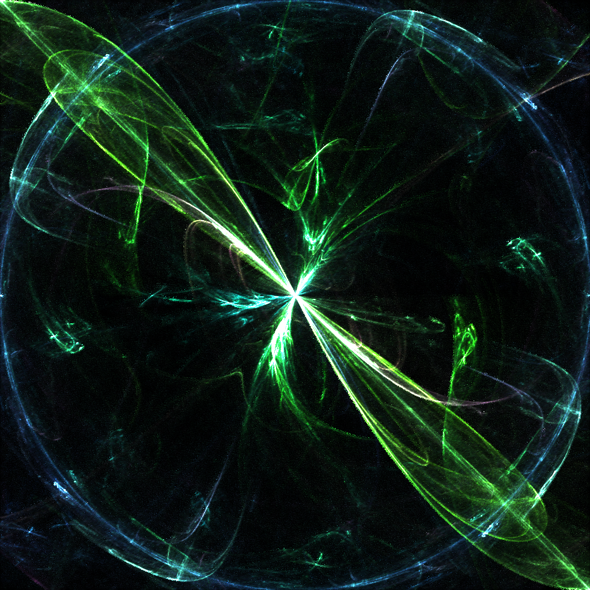

# Fractal Flames

This is an implementation of the fractal flames algorithm by Scott Draves. The actual logic is header-only and is intended to be usable as a library that asynchronously generates fractal flame images. There is also an executable that will generate fractal flame images and write them to disk.  

Here is an example generated image:


It spawns its own threads and operates asynchronously, generating images and writing the output frames to a shared thread safe buffer that the caller registers (see [main.cpp](./main.cpp) for an example). 

## Dependencies

- docker

## Setup 

To build the image:
```shell
bash script/build
```

## Testing

To run tests:
```shell
bash script/test
```

## Running

To generate some fractal flame images in a directory called `generated`:
```shell
bash script/run generated
```

To see the possible configurable parameters:
```shell
docker run -it --rm fflames:latest
```
